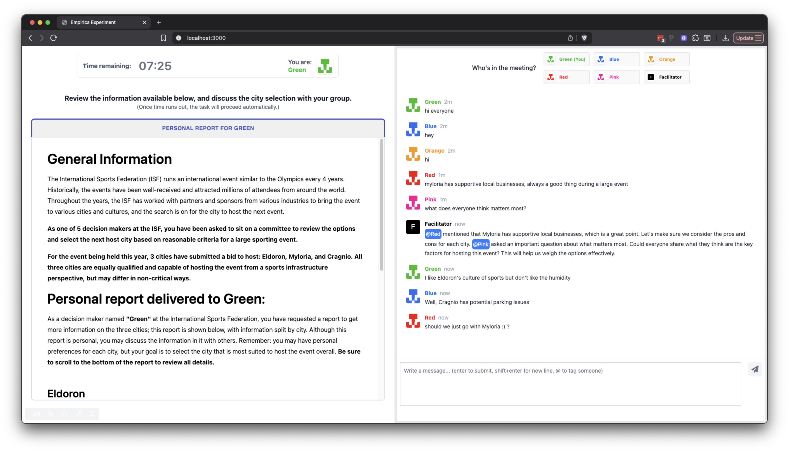

# Group-AI Interaction Laboratory (GRAIL)



## Overview

**Group-AI Interaction Laboratory (GRAIL)** is an open-source experimental platform for studying how groups of people interact with AI systems in real-time, multi-participant tasks. Built to support high-throughput, synchronous group experiments, GRAIL makes it easy to design, deploy, and analyze studies of AI-mediated collaboration—such as LLM-based facilitation—while handling the logistical complexity of live group coordination, chat interfaces, and data collection. It is designed to help researchers flexibly explore the design space of group-AI interaction without needing to build bespoke infrastructure from scratch.

## What is GRAIL made for? 

GRAIL enables researchers to design and run online experiments in which groups of participants interact synchronously with a shared large language model. Our accompanying [paper](<https://arxiv.org/abs/2508.08242>) demonstrates GRAIL in use through a large-scale experimental study, illustrating the kinds of group–AI interaction research the platform is designed to support.


### Intended uses

GRAIL is intended for research use in the study of group–AI interaction. It is best suited for designing and running controlled online experiments in which groups of participants interact synchronously with a shared AI system, such as studies of facilitation, moderation, coordination, or collaborative decision-making.

GRAIL is shared with the research community to support reproducibility of our published findings and to enable further exploration of how AI systems shape group processes and outcomes in interactive settings.

Findings generated using GRAIL are meant to inform research and design, rather than to directly guide operational decisions without additional validation, domain adaptation, and oversight.

### Out-of-scope uses

GRAIL is not intended for direct deployment as a production system or for use in real-world, high-stakes decision-making contexts. It is released for research purposes.

## Getting started

GRAIL was developed using the open-source [Empirica](https://empirica.ly/) framework (v1.12.0).

### Project structure

```
.empirica/             # Empirica configuration (treatments, lobbies, auth)
client/                # React front-end (participant UI, intro/exit steps)
  src/
    intro-exit/        # Consent, introduction, surveys, and exit screens
    components/        # Reusable UI components (chat, timer, player list, player-specific views)
server/                # Back-end configuration (game logic, LLM integration)
  src/
    callbacks.js       # Core game and LLM logic
    LLMConfig.js       # LLM system prompts
    HPTConfig.json     # Task stimuli configuration
```

### Running GRAIL locally

1.  Install Empirica (v1.12.0) following the instructions [here](https://docs.empirica.ly/getting-started/setup).
2.  Install the client-side and server-side packages by running `npm install` within `./client` and `./server` respectively.
3.  Copy `./server/.env.example` to `./server/.env` and fill in your LLM configuration (see [Connecting an LLM](#connecting-an-llm) below).
4.  Copy `.empirica/empirica.toml.example` to `.empirica/empirica.toml` and set your own `srtoken` and admin `password`.
5.  From the root project directory, run `empirica` to launch the server. By default, the admin panel should be accessible through your browser at `localhost:3000/admin`. The default username and password are configured in `.empirica/empirica.toml`.

### Running GRAIL remotely

Follow [this guide](<https://docs.empirica.ly/guides/deploying-my-experiment/ubuntu-tutorial>) for deploying Empirica experiments on Ubuntu servers.

#### Counterbalancing (S1-S4 randomized-block allocation)

Counterbalancing (which of S1-S4 each Game gets) is allocated automatically by `server/src/callbacks.js`'s `onGameStart` -- not by an Admin-configured treatment. Every 4 Games get a shuffled permutation of {S1,S2,S3,S4} (a permuted block), guaranteeing each sequence appears exactly once per 4 Games; the assigned `sequenceId` is persisted on the Game (`game.get("sequenceId")`) the first time `onGameStart` runs for it. This is server-process in-memory state only: if the backend process restarts while a block is partially claimed, the remaining positions in that block are lost and a new block starts from the beginning on the next Game. There is no study-level allocation ledger and no single-backend-process deployment constraint tied to counterbalancing.

### Configuring GRAIL

#### Connecting an LLM

GRAIL calls the OpenAI Responses API to generate LLM facilitator messages. Configure the connection by creating a `./server/.env` file with the following variables:

| Variable | Description | Default |
| --- | --- | --- |
| `OPENAI_API_KEY` | Your OpenAI API key (required) | — |
| `OPENAI_MODEL` | Model to use (e.g., `gpt-4o`, `gpt-5-mini`) | `gpt-4o` |
| `LLM_API_ENDPOINT` | API endpoint URL | `https://api.openai.com/v1/responses` |
| `LLM_MAX_OUTPUT_TOKENS` | Maximum number of tokens in the LLM response | `1000` |

See `./server/.env.example` for a template. Only `max_output_tokens` is sent as a model parameter by default. If you need to pass additional model-specific parameters (e.g., `temperature`, `reasoning`), you can add them to the `data` object in `server/src/callbacks.js`.

Any endpoint compatible with the OpenAI Responses API format can be used by changing `LLM_API_ENDPOINT`.

#### Creating and editing treatments

Within GRAIL (and Empirica, more broadly), experimental treatments are defined as combinations of factors, which are individual dimensions (e.g., group size, task duration, etc.). Treatments are defined in `.empirica/treatments.yaml`. The currently implemented factors are:

| Factor | Description |
| --- | --- |
| `facilitation` | Facilitation type: `none`, `human`, or `LLM` |
| `playerCount` | Number of participants per game |
| `gameDuration` | Duration of the task stage in minutes |
| `introDuration` | Duration of the introduction stage in minutes |
| `llmRequestInterval` | How often (in seconds) the server queries the LLM |
| `requireLLMMessage` | Whether the LLM must respond every interval (`true`) or can refrain from responding (`false`) |
| `fullInfo` | Whether participants receive full or partial information |
| `hiddenInfoCue` | Whether participants are shown a cue about differing information at the beginning of the discussion|

To add or modify factors & treatments, you can edit `.empirica/treatments.yaml` directly, or through the "Factors" and "Treatments" tabs in the admin panel. New factors can also be added there and then referenced in `server/src/callbacks.js`.

#### Configuring task stimuli

The included task configuration demonstrates GRAIL with a *hidden profile task*, in which participants each receive partial information and must share it with the group to reach an optimal decision. However, GRAIL can be adapted to other text-based group tasks with minimal changes — simply replace the stimuli in the config file, update the intro steps and LLM system prompt to match your task, and adjust the exit survey as needed.

Task stimuli (the information shown to each participant) are defined in `server/src/HPTConfig.json`. This file contains a `playerConfig` array where each entry specifies a player's name, color, and task-related content. The number of entries should be at least as large as the maximum `playerCount` across your treatments.

Each entry has the following fields:
- `playerName`: Display name for the participant (e.g., `"Green"`, `"Blue"`)
- `playerContent`: The content to be displayed to the specified participant, in Markdown
- `playerContent_fullinfo`: The full-information version (used when `fullInfo` is `true`)
- `hexCode`: The player's color hex code

The LLM system prompt can be customized in `server/src/LLMConfig.js`.

### Operating GRAIL

#### Creating sessions

To create game lobbies, login to the Admin Panel, create a new **batch**, and add **games** to the batch by selecting **treatments** and how many games should be created for each treatment. When running GRAIL locally, you can join the lobby and test your experiment by navigating to the participant view (http://localhost:3000/ by default). In local testing, additional "players" can be created in a new tab through the utility bar in the bottom left of the window. 

#### Customizing intro and exit steps

The sequence of screens participants see before and after a game are defined in `client/src/App.jsx` via the `introSteps` and `exitSteps` functions.

- **Intro steps** are shown to each participant after they join a game lobby but before the task begins. By default these include an introduction screen, a UI walkthrough, and an attention check (`Introduction`, `UserInterface`, `AttentionCheck`).
- **Exit steps** are shown after the game ends. By default these include a final answer submission, a NASA-TLX workload survey, a subjective survey, and a feedback form (`SubmitAnswer`, `TLX`, `SubjectiveSurvey`, `ExpFeedback`).

Each step is a React component located in `client/src/intro-exit/`. To customize the flow, add or remove components from the arrays returned by `introSteps` and `exitSteps` in `App.jsx`. Additional screens like the consent form (`consent`), lobby (`lobby`), and post-experiment completion page (`finished`) can also be swapped by changing the corresponding props on `EmpiricaContext` in the same file.

The default consent form (`client/src/intro-exit/Consent.jsx`) contains placeholder text and must be replaced with your own IRB-approved consent form before deploying a study.

Several exit screens (`FinishedExitCode.jsx`, `GamesFull.jsx`, `NoGames.jsx`) display completion codes with a `[INSERT CODE HERE]` placeholder. Replace these with your own study-specific codes (e.g., Prolific or MTurk completion codes). The participant identifier prompt in `PlayerCreate.tsx` can also be customized to match your recruitment platform.

#### Exporting data

All data is stored in the `.empirica/tajriba.json` file. To export it to CSV, run `empirica export` in the root project directory.

**NOTE:** Factors such as latency and misconfigured client clocks can make client-side timestamps unreliable for analyses that depend on message order. Instead, see `utils/server_side_timestamps.ipynb` for an example of how to correct these timestamps with server-side timestamps parsed from the raw `tajriba.json` file.

**DANGER:** Deleting tajriba.json will remove any game-level data you may have already collected. It is best practice to instead copy/move it to another location (e.g. a `data_exports` folder) before deletion.

#### LLM request logging

Every LLM request made during a game is automatically logged to the game's `llmLog` attribute (accessible in the exported data). Each log entry includes the timestamp, time elapsed/remaining, the model used, the full message payload sent to the LLM, the LLM's response, whether the message was added to the chat, and whether the request was triggered by the interval timer or by a participant tagging the facilitator.

## Limitations
GRAIL was developed as a research and experimental platform, not as a production-ready system. It has not been validated for use in commercial or real-world decision-making contexts, and additional testing, engineering, and oversight would be required before considering such applications.

GRAIL has primarily been designed and evaluated in English-language settings. Because GRAIL supports experiments involving AI-generated messages and interventions, outcomes may reflect factual errors, incomplete reasoning, or speculative content produced by the underlying model. GRAIL does not verify or guarantee the correctness of AI-generated outputs; researchers are responsible for designing studies, interpreting results, and ensuring appropriate human oversight.

Using GRAIL requires the use of an LLM. We do not provide access to an LLM (whether locally-hosted or API-based) and users of the system must integrate the system with their own LLM provider (e.g., OpenAI API key). GRAIL is model-agnostic but inherits the limitations, biases, and failure modes of whichever language model is integrated into a given experiment. These characteristics may influence participant behavior, experimental outcomes, and downstream analyses, and should be carefully considered when selecting models and interpreting results.

Finally, GRAIL was not designed with comprehensive security hardening in mind. It has not been systematically evaluated for robustness against threats such as prompt injection, misuse of AI outputs, or adversarial participant behavior, and additional safeguards may be necessary depending on the experimental context.

## Best practices
*   Users are reminded to be mindful of data privacy concerns and are encouraged to review the privacy policies associated with any models and data storage solutions interfacing with GRAIL.
*   It is the user’s responsibility to ensure that the use of GRAIL complies with relevant data protection regulations and organizational guidelines.
*   Researchers should follow transparency best practices and inform study participants that they are interacting with an AI system.
*   Researchers should follow best practices for conducting research involving human participants by obtaining the approval of an Institutional Review Board (IRB) or other ethics review authority before initiating study procedures. Procedures should include obtaining the informed consent of the participants prior to data collection.

## License

MIT License

Nothing disclosed here, including the Out of Scope Uses section, should be interpreted as or deemed a restriction or modification to the license the code is released under.

## Trademarks

This project may contain trademarks or logos for projects, products, or services. Authorized use of Microsoft trademarks or logos is subject to and must follow Microsoft's Trademark & Brand Guidelines. Use of Microsoft trademarks or logos in modified versions of this project must not cause confusion or imply Microsoft sponsorship. Any use of third-party trademarks or logos are subject to those third-party's policies.

## Contact

This research was conducted by members of <https://www.microsoft.com/en-us/research/>. We welcome feedback and collaboration from our audience. If you have suggestions, questions, or observe unexpected/offensive behavior in our technology, please contact Dan Goldstein (<dgg@microsoft.com>) or Mohammed Alsobay (<malsobay@microsoft.com>).

If the team receives reports of undesired behavior or identifies issues independently, we will update this repository with appropriate mitigations.
